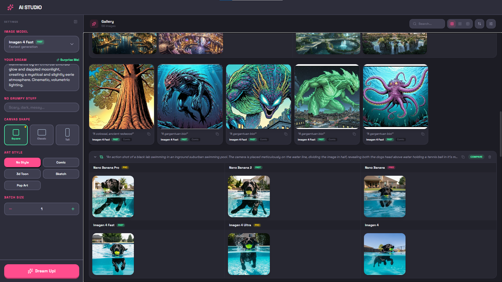

# AI Image Studio

A real-time AI image generation studio built with React, Convex, and Google's Gemini/Imagen APIs.

   



## Features

- **Multi-Model Generation** — 6 Google AI models (Imagen 4, Imagen 4 Ultra, Imagen 4 Fast, Nano Banana, Nano Banana 2, Nano Banana Pro)
- **Side-by-Side Comparison** — Select multiple models, compare outputs with collapsible groups
- **Art Styles** — Comic, 3D Toon, Sketch, Pop Art
- **Canvas Shapes** — Square (1:1), Classic (4:3), Tall (3:4)
- **Batch Generation** — 1-4 images per request
- **Gallery** — Search, sort, filter by model/style, prompt copy, image deletion
- **Collapsible Sidebar** — Toggle settings panel to maximize gallery space
- **Lightbox** — Full-screen viewing with download
- **Surprise Me** — AI-powered random prompt generation
- **Real-Time Updates** — Live status via Convex
- **Persistent Settings** — Saved to localStorage

## Tech Stack

| Layer | Technology |
|-------|-----------|
| Frontend | React 19, TypeScript, Tailwind CSS 4 |
| UI Primitives | Base UI (ScrollArea) |
| Backend | Convex (real-time BaaS) |
| AI APIs | Google Gemini API, Google Imagen API |
| Build | Vite 7 |
| Icons | Lucide React |

## Getting Started

### Prerequisites

- [Bun](https://bun.sh/)
- [Google AI Studio](https://aistudio.google.com/) API key
- [Convex](https://www.convex.dev/) account

### Setup

```bash
bun install
bunx convex dev
```

Add your API key in the [Convex Dashboard](https://dashboard.convex.dev/) under **Settings > Environment Variables**:

```
GEMINI_API_KEY=your_google_ai_api_key_here
```

### Run

```bash
bunx convex dev   # Terminal 1
bun run dev       # Terminal 2
```

Open [http://localhost:5173](http://localhost:5173).

## Project Structure

```
├── convex/
│   ├── schema.ts            # Database schema
│   ├── generations.ts       # CRUD operations
│   ├── generate.ts          # Image generation (Gemini + Imagen)
│   └── surprise.ts          # Random prompt generator
├── src/
│   ├── App.tsx              # Root component, state management
│   ├── models.ts            # AI model definitions
│   ├── index.css            # Tailwind theme & global styles
│   └── components/
│       ├── Header.tsx
│       ├── Sidebar.tsx      # Collapsible settings panel
│       ├── Gallery.tsx      # Image gallery with search, sort, filters
│       ├── ImageCard.tsx    # Image card with hover actions
│       ├── ScrollArea.tsx   # Custom themed scrollbar
│       └── Toast.tsx
```

## License

MIT
